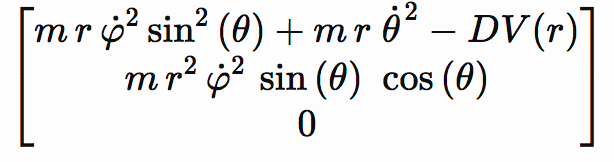

# sicmutils

A Clojure(script) implementation of the
[Scmutils](https://groups.csail.mit.edu/mac/users/gjs/6946/refman.txt) system
for math and physics investigations in the Clojure language.

Scmutils is extensively used in the textbooks [The Structure and Interpretation
of Classical Mechanics][SICM] and [Functional Differential Geometry][FDG] by
G.J. Sussman and J. Wisdom.

> :wave: Need help getting started? Say hi on [Twitter](https://twitter.com/sritchie) or [Clojurians Slack](http://clojurians.net/) in [#sicmutils](https://clojurians.slack.com/archives/C01ECA9AA74).

[](https://github.com/sicmutils/sicmutils/actions?query=workflow%3A%22Clojure+CI%22)
[](https://github.com/sicmutils/sicmutils/blob/master/LICENSE)
[](https://codecov.io/github/sicmutils/sicmutils)
[](https://cljdoc.org/d/sicmutils/sicmutils/CURRENT)
[](https://clojars.org/sicmutils/sicmutils)

## Quickstart

Install SICMUtils into your Clojure(script) project using the instructions at
its Clojars page:

[](https://clojars.org/sicmutils/sicmutils)

Initialize a REPL and simplify a trigonometric identity:

```clojure
user=> (require '[sicmutils.env :as env])
user=> (env/bootstrap-repl!)
user=> (def render (comp ->infix simplify))
user=> (render
        (+ (square (sin 'x))
           (square (cos 'x))))
1
```

Define a Lagrangian and generate the Lagrange equations of motion for the
physical system it describes, rendered in polar coordinates:

```clojure
(defn L-central-polar [m U]
  (fn [[_ [r] [rdot φdot]]]
    (- (* 1/2 m
          (+ (square rdot)
             (square (* r φdot))))
       (U r))))
#'user/L-central-polar

user=>
(let [potential-fn (literal-function 'U)
      L     (L-central-polar 'm potential-fn)
      state (up (literal-function 'r)
                (literal-function 'φ))]
  (render
   (((Lagrange-equations L) state) 't)))
"down(- m (Dφ(t))² r(t) + m D²r(t) + DU(r(t)), 2 m Dφ(t) r(t) Dr(t) + m (r(t))² D²φ(t))"
```

Confused? You're not alone! This is a very dense library, and not well
documented (yet). Some suggested next steps, for now:

- Clone this repository and run `lein repl` for a batteries included REPL
  environment.
- Read the [SCMUtils Reference Manual][REFMAN] ("refman") for inspiration. This
  library can do almost everything in the refman.
- Visit the HTML version of [Structure and Interpretation of Classical
  Mechanics](https://tgvaughan.github.io/).

## Background

[SICM][SICM] and [FDG][FDG] can be thought of as spiritual successors to [The
Structure and Interpretation of Computer Programs][SICP], a very influential
text—as I can attest, since carefully reading this book in my 30s changed my
life as a programmer. To see the same techniques applied to differential
geometry and physics is an irresistible lure.

Scmutils is an excellent system, but it is written in an older variant
of LISP (Scheme) and is tied to a particular implementation of
Scheme—MIT/GNU Scheme. (There is a [port to Guile][GSCM], but due to
the fact that Guile does not support MIT Scheme's
[apply hooks](https://www.gnu.org/software/mit-scheme/documentation/stable/mit-scheme-ref/Application-Hooks.html)
some glue code is required to run examples from the book in that
environment.)

Having the system in Clojure offers a number of advantages. It is not
necessary to obtain or prepare a MIT/GNU Scheme executable to execute:
only a Java runtime is required. It does not require the X Window
System for graphics, as MIT Scheme does. All of the standard tooling
for Java and Clojure become available, and this is a lot compared to
what we get with MIT/GNU scheme.  Clojure support is now extensive in
any number of editors and IDEs. Even better, you can interact with the
system in the context of a [Jupyter notebook](./jupyter).

You can invoke the system from within Java code or use any Java
packages you like together with the mathematics system. It's my hope
that continuing this project will extend the reach of SICM and FDG by
allowing experimentation and collaboration with them in modern
environments.

## Status

Rather than just quasi-mechanically translate the Scheme to Clojure, I
have studied the implementation of the system before bringing it to
Clojure, and have used TDD throughout the project (which turned out to
be absolutely essential as I considered various approaches to problems
posed by the Scheme code base). At this writing there are over 1800
unit tests.

The implementation is not complete. My goal was to create a
system that could execute the example code in SICM and FDG directly
from the book, to the extent possible. I started with SICM, as the
requirements seemed the lesser; FDG code is written at a higher level
of abstraction. Starting with nothing, I tried to push the frontier of
the new code ever closer to approaching being able to execute the book
examples.

Naturally, this was harder than I thought. I began with the generic
operation system. Fortunately the
[lecture notes](http://groups.csail.mit.edu/mac/users/gjs/6.945/) GJS
provides for his 6.945 class in Symbolic Programming provided some
clues as to where to begin. With this implemented, some simple algebra
over symbols was possible. Handing structured objects (up and down
tuples, the system's analogs for contra- and covariant vectors) was
fun. What was less fun was understanding how the simplifier works with
the polynomial systems: that took a while! Finally I got
differentiation working, and then some of the book examples began to
work.

As of this writing, all of the code presented in SICM, editions 1 and
2, will execute correctly. Work has begun on FDG.

## What's "working" now

```scheme
; Scheme
(define ((L-central-polar m U) local)
  (let ((q (coordinate local))
        (qdot (velocity local)))
    (let ((r (ref q 0)) (phi (ref q 1))
          (rdot (ref qdot 0)) (phidot (ref qdot 1)))
      (- (* 1/2 m
           (+ (square rdot)
              (square (* r phidot))) )
         (U r)))))
```

```clojure
; Clojure
(defn L-central-polar [m U]
  (fn [[_ [r] [rdot φdot]]]
    (- (* 1/2 m
          (+ (square rdot)
             (square (* r φdot))))
       (U r))))
```

We can see a few things from this example. `L-central-polar` wants to
compute a Lagrangian for a point mass `m` in a potential field `U`. In
Scheme, it's possible to specify currying at the site of a function's
definition: `(L-central-polar m U)` returns a function of the `local`
tuple (a sequence of time, generalized coordinates, and generalized
velocities). We don't have that syntax in Clojure, but instead have
something even more useful: argument destructuring. We can pick out
exactly the coordinates we want out of the local tuple components
directly.

While function definitions cannot be typed directly from the book,
function applications in Clojure and Scheme are the same. The
following works in both systems:

```clojure
(((Lagrange-equations (L-central-polar 'm (literal-function 'U)))
  (up (literal-function 'r)
      (literal-function 'φ)))
  't)
```
yielding

```clojure
(down
 (+ (* -1N m (expt ((D φ) t) 2) (r t)) (* m (((expt D 2) r) t)) ((D U) (r t)))
 (+ (* 2N m ((D φ) t) (r t) ((D r) t)) (* m (expt (r t) 2) (((expt D 2) φ) t))))
```

Which, modulo a few things, is what Scmutils would give. From later
in [SICM][SICM] (pp. 81-2) we have, in Scheme:

```scheme
(define ((T3-spherical m) state)
  (let ((t (time state))
        (q (coordinate state))
        (qdot (velocity state)))
    (let ((r (ref q 0))
          (theta (ref q 1))
          (phi (ref q 2))
          (rdot (ref qdot 0))
          (thetadot (ref qdot 1))
          (phidot (ref qdot 2)))
      (* 1/2 m
         (+ (square rdot)
            (square (* r thetadot))
            (square (* r (sin theta) phidot)))))))

(define (L3-central m Vr)
  (define (Vs state)
    (let ((r (ref (coordinate state) 0)))
      (Vr r)))
  (- (T3-spherical m) Vs))

(((partial 1) (L3-central ’m (literal-function ’V)))
  (up ’t
      (up ’r ’theta ’phi)
      (up ’rdot ’thetadot ’phidot)))
```

And in Clojure, using a couple of simplifying definitions:

```clojure
(def V (literal-function 'V))
(def spherical-state (up 't
                         (up 'r 'θ 'φ)
                         (up 'rdot 'θdot 'φdot)))
(defn T3-spherical [m]
  (fn [[t [r θ φ] [rdot θdot φdot]]]
    (* 1/2 m (+ (square rdot)
                (square (* r θdot))
                (square (* r (sin θ) φdot))))))

(defn L3-central [m Vr]
  (let [Vs (fn [[_ [r]]] (Vr r))]
    (- (T3-spherical m) Vs)))

(((partial 1) (L3-central 'm V)) spherical-state)
```
yielding
```clojure
(down
 (+ (* m r (expt φdot 2) (expt (sin θ) 2)) (* m r (expt θdot 2)) (* -1 ((D V) r)))
 (* m (expt r 2) (expt φdot 2) (sin θ) (cos θ))
 0)
```

Which again agrees with Scmutils modulo notation. (These results are
examples of "down tuples", or covariant vectors, since they represent
derivatives of objects in primal space.) The partial derivative
operation is called `partial` in Scmutils, but Clojure defines
`partial` to mean partial function application. In this system,
we take a page from JavaScript and replace partial with a shim
which will compute partial derivatives when all the arguments are
integers and fall back to Clojure's definition of partial otherwise.
Since it doesn't make sense to partially apply an integer, `partial`
should just do the right thing.

You could render that result in TeX:



using the `->TeX` function. You can also use `->infix` to obtain

```
down(m r φdot² sin²(θ) + m r θdot² - DV(r), m r² φdot² sin(θ) cos(θ), 0)
```

or even `->JavaScript` to get:

```JavaScript
function(D, V, m, r, θ, θdot, φdot) {
  var _0001 = Math.sin(θ);
  var _0002 = Math.pow(φdot, 2);
  return [m * r * _0002 * Math.pow(_0001, 2) + m * r * Math.pow(θdot, 2) - (D(V)(r)), m * Math.pow(r, 2) * _0002 * _0001 * Math.cos(θ), 0];
}
```

(For rendering into code, a simple common-subexpression extraction
algorithm is used.)

### Numerical Methods

This system uses the delightful [Apache Commons Math][ACM] library to implement
some of the numerical methods needed for the book. Many of the methods we used
to pull from Commons are now implemented in native Clojure(script); our goal is
to remove this dependency once we get a pure Clojure implementation of the
Gragg-Bulirsch-Stoer ODE integrator implemented.

The Scmutils simplifier has three engines: a polynomial-based simplifier
useful for grouping like terms, a rational-function-based simplifier
used for cancellation in fractional expressions, and a rule-based
simplifier to apply identities like sin² x + cos² x = 1.

I have implemented all of these, but acceptable performance from the
rational-function simplifier is waiting for an implementation of
Zippel's algorithm for fast multivariate polynomial GCD operations.
Currently we use a recursive Euclid algorithm, which gives acceptable
results for expressions of medium complexity, but there is more to
be done.

## What's not there yet

### The latter half of FDG

Most of the code in the early sections of FDG will work, but this cannot
be considered compelte.

### Derivatives of nested functions

Or, what is described as "Alexey's Amazing Bug" in the Scmutils source
code (and further described by Oleksandr Manzyuk [here][OM]). This should
be straightforward to fix but hasn't been necessary for the work so far.

### Quaternions, and other exotica

The Scmutils library is vast, and I don't pretend to have covered
anywhere near all of it. The breadth-first approach I have used to get
the textbook examples working has left many corners of the source
library unexplored as of this writing.

## The experience of Clojure

This is my first real attempt at a project in Clojure, so I can't say
that everything I've done is idiomatic or the best possible. On the
other hand, I've written a fair amount of Scheme, so it has been a lot
of fun to consider how to best use Clojure's strengths in implementing
this. Of course, none of this project should be considered original
work of my own; it is the brainchild of G.J. Sussman and his
collaborators. But allow me take a moment to describe some of the
pleasant surprises I experienced while doing this.

First of all, a rich set of persistent data structures makes all the
difference. What few examples of mutability in Scmutils where present
have all been removed. Many instances of using association lists and
other `O(n)` data structures have been replaced by maps and sets, and
the sorted variants of those.

Using `defrecord` and `deftype` simplified the handling of a lot of
Scmutils objects that were simply the `cons` of a type tag and a
value.  Such types can implement `IFn` when they need to be callable,
allowing me to completely dodge the `apply-hook` technique used in
MIT/GNU Scheme, which is one of the main reasons the code would not
have been easy to port to other variants of Scheme, let alone any
other flavor of LISP.

The Scmutils code is essentially a monolith, given that Scheme has no
module scoping. This Clojure implementation partitions the codebase
into a variety of namespaces, with unit tests for each. This adds a
bit of sanity to the code absent in the original, where it is not easy
to see exactly how the user's environment is constructed. Clojure's
namespace facility allows us to prepare the environment in which
primitive operations like `+` and `*` are replaced with their
namespace-qualified generic equivalents exactly at the point where
this is necessary; but also allows the generic operations to be mixed
with the native operations when this is useful.

## Running the code

Installation is simple if you have [leiningen][LEIN]; this tool will arrange
to retrieve everything else you need. On Mac OS, for example,

~~~ sh
$ brew install leiningen
~~~

ought to get you started. Clone the repo. `lein repl` will start a REPL
with the math symbols brought into scope and with command line editing
capability. For example, to run the demonstration script in
`demo.clj`, you can:

~~~ sh
$ lein repl < demo.clj
~~~

To run the test suite:

~~~ sh
$ lein test
~~~

`lein test :all` will run some additional tests that may take a while to execute.

To run the Clojurescript tests, run:

```sh
lein test-cljs
```

## License

GPL v3.

[SICM]: http://mitpress.mit.edu/books/structure-and-interpretation-classical-mechanics
[FDG]: http://mitpress.mit.edu/books/functional-differential-geometry
[SICP]: http://mitpress.mit.edu/sicp/
[OM]: http://oleksandrmanzyuk.files.wordpress.com/2012/04/paper.pdf
[GSCM]: http://www.cs.rochester.edu/~gildea/guile-scmutils/
[ACM]: https://commons.apache.org/proper/commons-math/
[LEIN]: http://leiningen.org
[REFMAN]: https://groups.csail.mit.edu/mac/users/gjs/6946/refman.txt

Copyright © 2016 Colin Smith
